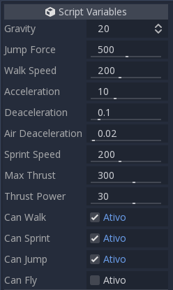
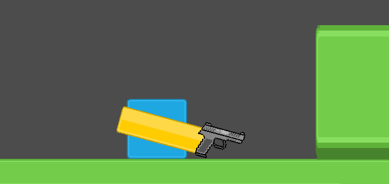
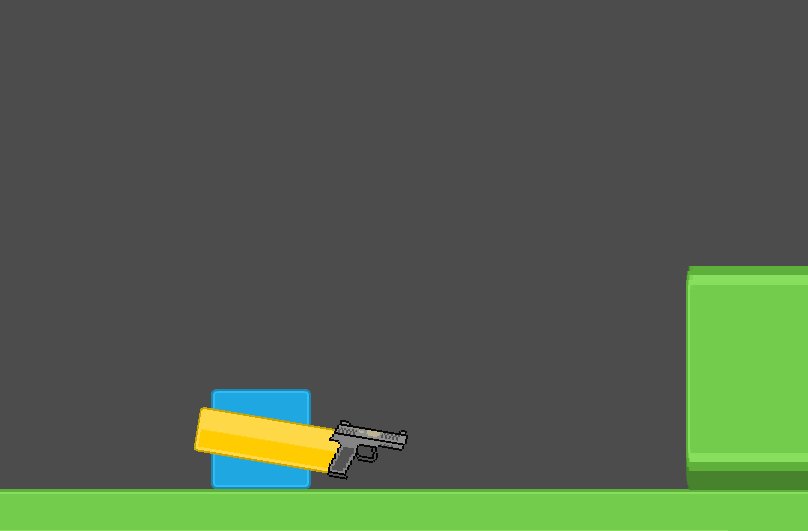

# godot-my-nodes

My custom nodes, writed to help people save time developing games in Godot.

## BasicMovement2D
This script provides a basic player movement, with editable values, and options to sprint and fly.

It also emits signals for each action.

Copy this script to your project, and a new node 'BasicMovement2D' will appear in godot's list, as a KinematicBody2D's child.

### Options available

## ArmPointingToMouse2D

This script provides a node that is always looking at the mouse pointer.

## RaycastWeapon2D

## MissileWeapon2D

